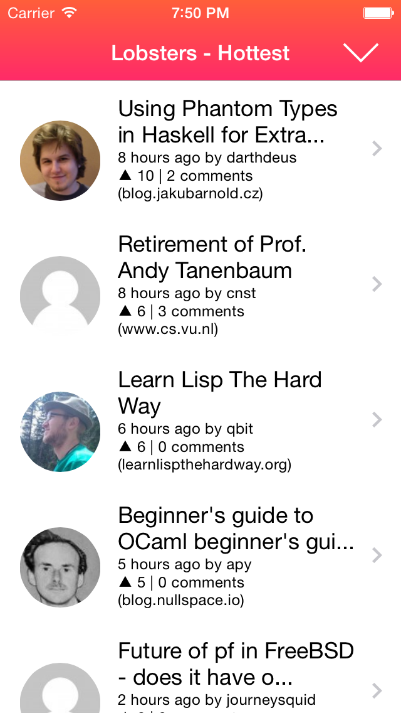
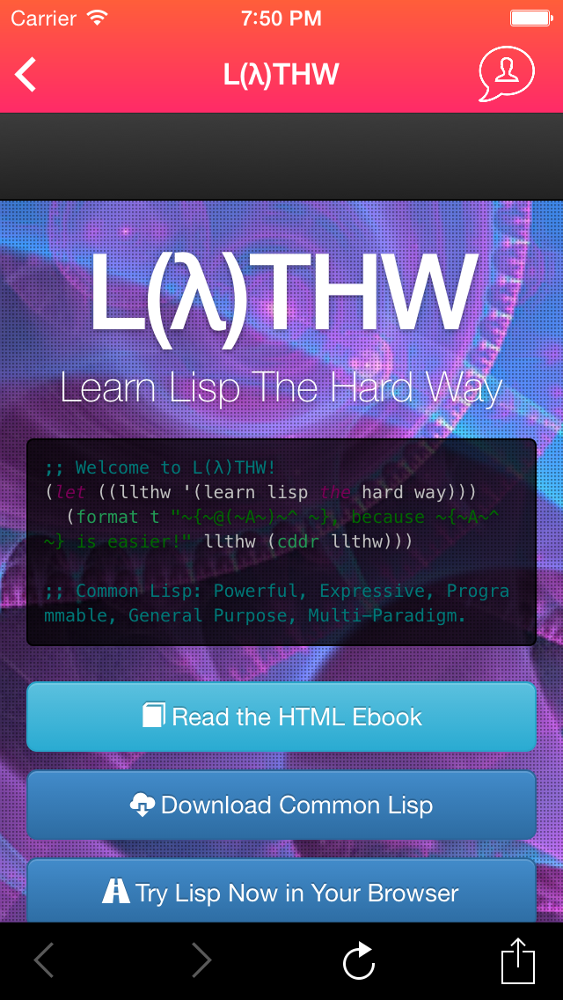

# Lobsters for iOS

Lobsters is a technology-focused link-aggregation site created in July 2012 by joshua stein. It is similar to Hacker News, Reddit, and Slashdot, and borrows some ideas from, while also attempting to fixing problems specific to, each of those sites.

This app is a non-offical iOS app build with RubyMotion to browse and enjoy [Lobste.rs](http://lobste.rs), whilst providing a native iOS feel.

>Though not strictly forbidden by the license, please do not submit unmodified (or trivially modified) versions of this application to the App Store.

## App Store

__Coming Soon__ (Currently awaiting approval).

## Screenshots!

>Story List View

>Story View

## Building

__Please Note__: A licenced RubyMotion installation is required to build this project. If this is not available, you can download it from the App Store.

Dependencies:

[RubyMotion](http://www.rubymotion.com/)
[Ruby](https://www.ruby-lang.org/en/)
[Bundler](http://bundler.io/)
[XCode](https://developer.apple.com/xcode/) (newer than XCode 5)
[CocoaPods](http://cocoapods.org/) (fetched by bundler)

To build `lobsters-ios`, firstly clone this repository locally and change into it's directory.

1. Grab the Ruby gems: `bundle install`
2. Grab the CocoaPods: `rake pod:install`
3. Run it! `rake` (simulator) or `rake device` (device)

## Issues

Have any feedback, bug reports, or comments? [Open an issue](https://github.com/JamesS237/lobsters-ios/issues)!

## Contributing

See CONTRIBUTING.md

### Roadmap
- Unit testing
- CI
- Make comment viewing nicer
- Offline cache
- Any ideas? Open an issue!

## Licence

The MIT License (MIT)

Copyright (c) 2014 James Spencer

Permission is hereby granted, free of charge, to any person obtaining a copy
of this software and associated documentation files (the "Software"), to deal
in the Software without restriction, including without limitation the rights
to use, copy, modify, merge, publish, distribute, sublicense, and/or sell
copies of the Software, and to permit persons to whom the Software is
furnished to do so, subject to the following conditions:

The above copyright notice and this permission notice shall be included in
all copies or substantial portions of the Software.

THE SOFTWARE IS PROVIDED "AS IS", WITHOUT WARRANTY OF ANY KIND, EXPRESS OR
IMPLIED, INCLUDING BUT NOT LIMITED TO THE WARRANTIES OF MERCHANTABILITY,
FITNESS FOR A PARTICULAR PURPOSE AND NONINFRINGEMENT. IN NO EVENT SHALL THE
AUTHORS OR COPYRIGHT HOLDERS BE LIABLE FOR ANY CLAIM, DAMAGES OR OTHER
LIABILITY, WHETHER IN AN ACTION OF CONTRACT, TORT OR OTHERWISE, ARISING FROM,
OUT OF OR IN CONNECTION WITH THE SOFTWARE OR THE USE OR OTHER DEALINGS IN
THE SOFTWARE.

## Lobste.rs Licence

Copyright (c) 2012-2014 joshua stein <jcs@jcs.org>

Redistribution and use in source and binary forms, with or without
modification, are permitted provided that the following conditions
are met:

1. Redistributions of source code must retain the above copyright
   notice, this list of conditions and the following disclaimer.
2. Redistributions in binary form must reproduce the above copyright
   notice, this list of conditions and the following disclaimer in the
   documentation and/or other materials provided with the distribution.
3. The name of the author may not be used to endorse or promote products
   derived from this software without specific prior written permission.

THIS SOFTWARE IS PROVIDED BY THE AUTHOR ``AS IS'' AND ANY EXPRESS OR
IMPLIED WARRANTIES, INCLUDING, BUT NOT LIMITED TO, THE IMPLIED WARRANTIES
OF MERCHANTABILITY AND FITNESS FOR A PARTICULAR PURPOSE ARE DISCLAIMED.
IN NO EVENT SHALL THE AUTHOR BE LIABLE FOR ANY DIRECT, INDIRECT,
INCIDENTAL, SPECIAL, EXEMPLARY, OR CONSEQUENTIAL DAMAGES (INCLUDING, BUT
NOT LIMITED TO, PROCUREMENT OF SUBSTITUTE GOODS OR SERVICES; LOSS OF USE,
DATA, OR PROFITS; OR BUSINESS INTERRUPTION) HOWEVER CAUSED AND ON ANY
THEORY OF LIABILITY, WHETHER IN CONTRACT, STRICT LIABILITY, OR TORT
(INCLUDING NEGLIGENCE OR OTHERWISE) ARISING IN ANY WAY OUT OF THE USE OF
THIS SOFTWARE, EVEN IF ADVISED OF THE POSSIBILITY OF SUCH DAMAGE.
